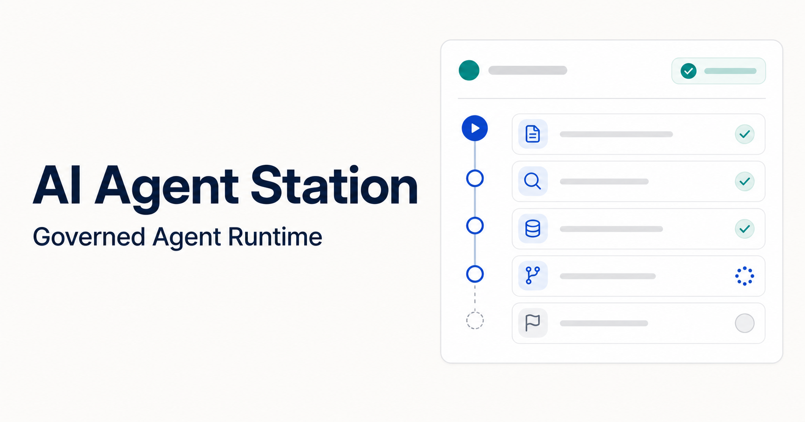
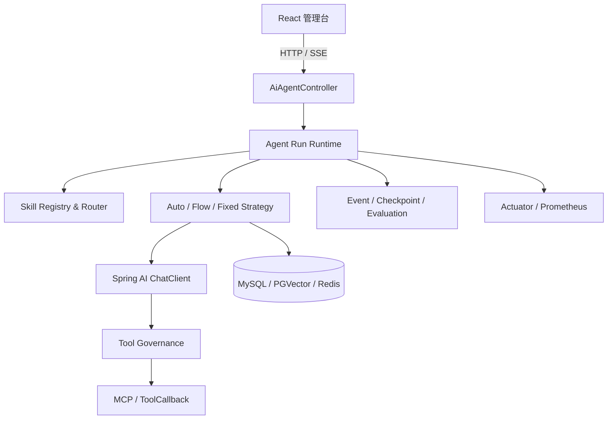
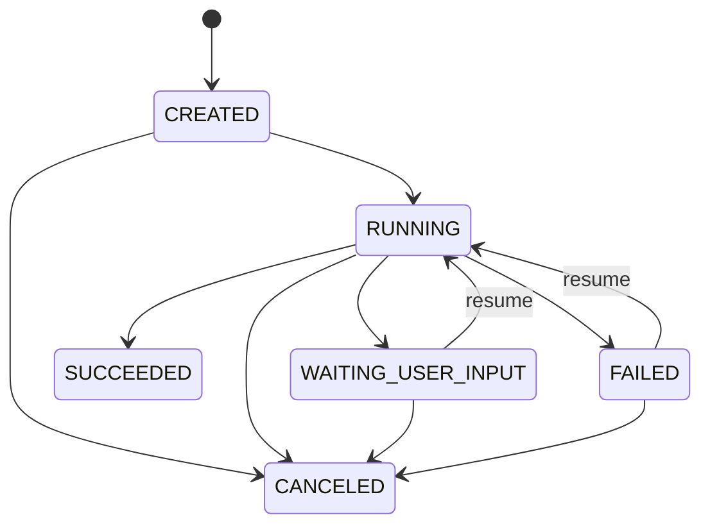

<h1 align="center">AI Agent Station</h1>

<p align="center">
  面向复杂任务的可治理 AI Agent 平台<br/>
  让 Skills、运行状态、工具权限和执行审计从 Demo 进入可管理的工程边界
</p>

<div align="center">


[在线介绍](https://wangyijie01.github.io/ai-agent-station-v2/) · [功能特性](#-功能特性) · [架构设计](#-架构设计) · [快速开始](#-快速开始) · [项目结构](#-项目结构)

</div>

---

## 📖 项目介绍

AI Agent Station 是一个前后端一体的智能体工程项目。平台基于 Spring AI 组织模型、Prompt、Advisor、RAG 与 MCP 工具，并在传统 Agent 编排能力之上增加文件型 Skills、Run 状态机、断点恢复、工具权限治理、SSE 事件审计和 Prometheus 可观测能力。

项目重点不只是“让模型调用工具”，而是回答下面几个工程问题：

- 一次 Agent 执行如何拥有稳定、可查询的运行身份？
- 模型选择了什么 Skill、调用了什么工具，能否被解释和审计？
- 高风险工具如何经过白名单、预算和人工授权后再执行？
- 任务等待补充信息或执行失败后，能否从检查点继续？
- 前端能否实时看到 Run 状态、SSE 事件、质量评估与工具审计？

> [!NOTE]
> 当前仓库已经合并后端、React 管理台和项目介绍页，`backend`、`frontend`、`docs` 共同组成一个完整项目，不再需要分别查找两个仓库。



## ✨ 功能特性

### 🤖 Agent 编排与 Skills

- ✅ 支持 Auto、Flow、Fixed 三种 Agent 执行策略
- ✅ 从 `SKILL.md` 加载场景说明、触发词、优先级、风险级别和工具白名单
- ✅ 支持显式选择 Skill，也支持根据用户任务进行可解释路由
- ✅ 结构化解析模型决策，并保留旧格式兼容能力

### 🔄 Run 生命周期

- ✅ 为每次执行生成 `runId`、`traceId` 和有序事件序号
- ✅ 支持创建、运行、等待用户输入、成功、失败和取消状态
- ✅ 使用客户端幂等键避免重复创建相同 Run
- ✅ 支持检查点、失败恢复和等待补充信息后的继续执行

### 🛡️ 工具治理

- ✅ 默认拒绝未进入 Skill 白名单的工具
- ✅ 按只读、中风险、高风险对工具调用进行分级
- ✅ 高风险调用必须命中可信授权列表
- ✅ 提供调用预算、只读重试、幂等结果、熔断和敏感信息脱敏
- ✅ 记录工具决策、耗时、尝试次数和输入摘要，便于追踪审计

### 📡 事件与可观测

- ✅ 通过 SSE 实时返回 Agent 决策、工具调用和状态变化
- ✅ 支持查询 Run 快照、事件、检查点、质量评估和工具审计
- ✅ 基于 Spring Boot Actuator 暴露健康检查和 Prometheus 指标
- ✅ 统计 Run 状态转换、工具调用次数与执行耗时

### 🖥️ React 管理台

- ✅ 管理 Agent、Client、Model、Prompt、Advisor、RAG 和 MCP 配置
- ✅ 使用 FlowGram 可视化编辑 Agent 工作流
- ✅ 在运行台选择 Skills、设置最大步数和工具预算
- ✅ 新建、恢复、取消 Run，并查看实时事件时间线
- ✅ 查看运行评估结果和工具放行、拒绝、重试、熔断记录

## 🏗 架构设计

### 整体架构



### 一次 Run 的执行链路

```text
用户提交任务
    │
    ▼
幂等检查 ── 命中 ──► 返回已有 Run
    │ 未命中
    ▼
Skill 路由与工具白名单合并
    │
    ▼
创建 runId / traceId，进入 RUNNING
    │
    ▼
模型决策 ──► 工具治理 ──► MCP 工具
    │             │
    │             └── 白名单 / 风险 / 授权 / 预算 / 熔断 / 审计
    ▼
写入事件与检查点
    │
    ├── 需要补充信息 ──► WAITING_USER_INPUT ──► 恢复执行
    ├── 执行成功 ─────► SUCCEEDED
    ├── 执行异常 ─────► FAILED ──► 恢复执行
    └── 主动取消 ─────► CANCELED
```

### Run 状态机



更完整的状态约束、时序、数据模型与工程取舍见 [V2 设计文档](docs/agent-v2-design.md)，生产持久化表结构草案见 [Runtime SQL](docs/sql/agent-runtime-v2.sql)。

## 🧠 内置 Skills

| Skill | 使用场景 | 治理重点 |
| --- | --- | --- |
| `log-root-cause` | 日志根因分析 | 先收集证据，再给出根因与修复建议 |
| `monitoring-diagnosis` | 监控指标诊断 | 关联指标、时间窗口与异常趋势 |
| `knowledge-grounded-answer` | 知识库问答 | 回答必须基于检索到的证据 |
| `incident-response` | 线上故障响应 | 控制变更风险，保留处置记录 |
| `release-inspection` | 发布前后巡检 | 对比发布窗口内的健康状态 |
| `sql-performance` | SQL 性能诊断 | 分析执行计划、索引与慢查询 |

新增 Skill 只需在 `backend/ai-agent-station-study-domain/src/main/resources/agent-skills` 下创建目录和 `SKILL.md`，无需修改通用执行节点。

## 🛠 技术栈

### 后端

| 技术 | 版本 | 作用 |
| --- | --- | --- |
| Java | 17 | 核心开发语言 |
| Spring Boot | 3.4.3 | Web、依赖装配、任务与可观测 |
| Spring AI | 1.0.0 | ChatClient、Advisor、MCP 与向量检索 |
| MyBatis | 3.0.4 | 配置和业务数据访问 |
| MySQL | 8.x | Agent、Client、Prompt 等配置数据 |
| PostgreSQL + PGVector | - | RAG 向量知识库 |
| Redis | 6.x+ | 缓存及生产态幂等扩展 |
| Micrometer + Prometheus | - | 运行指标采集 |

### 前端

| 技术 | 作用 |
| --- | --- |
| React 18 + TypeScript | 管理台和运行控制台 |
| Rsbuild | 开发服务与生产构建 |
| Semi UI | 管理页面组件 |
| FlowGram | 可视化 Agent 工作流编辑器 |
| Fetch + SSE | REST API 与运行事件流 |

## 📁 项目结构

```text
ai-agent-station-v2/
├── backend/                              # Spring AI 多模块后端
│   ├── ai-agent-station-study-api/       # API 契约、DTO、响应模型
│   ├── ai-agent-station-study-app/       # Spring Boot 启动与配置
│   ├── ai-agent-station-study-domain/    # Agent 编排、Skills、Runtime
│   ├── ai-agent-station-study-trigger/   # HTTP 接口、任务和监听器
│   ├── ai-agent-station-study-infrastructure/ # DAO、Repository、外部适配
│   ├── ai-agent-station-study-types/     # 通用类型、异常和框架组件
│   ├── pom.xml
│   └── mvnw.cmd / mvnw
├── frontend/                             # React 管理台与运行控制台
│   ├── src/
│   ├── package.json
│   └── rsbuild.config.ts
├── docs/                                 # GitHub Pages、设计文档与 SQL
├── .github/workflows/pages.yml           # GitHub Pages 自动部署
└── README.md
```

## 🚀 快速开始

### 前置要求

- JDK 17+
- Node.js 20+ / npm 10+
- MySQL 8.x
- PostgreSQL + PGVector
- 可用的 OpenAI 兼容模型服务
- Redis（按实际配置启用）

### 1. 克隆项目

```bash
git clone https://github.com/wangyijie01/ai-agent-station-v2.git
cd ai-agent-station-v2
```

### 2. 准备后端环境变量

PowerShell 示例：

```powershell
$env:OPENAI_BASE_URL = "https://api.example.com"
$env:OPENAI_API_KEY = "<your-api-key>"
$env:MYSQL_USERNAME = "root"
$env:MYSQL_PASSWORD = "<your-password>"
$env:MYSQL_URL = "jdbc:mysql://127.0.0.1:3306/ai-agent-station-study?useUnicode=true&characterEncoding=utf8&serverTimezone=Asia/Shanghai"
$env:PGVECTOR_USERNAME = "postgres"
$env:PGVECTOR_PASSWORD = "<your-password>"
$env:PGVECTOR_URL = "jdbc:postgresql://127.0.0.1:5432/ai-rag-knowledge"
```

> [!IMPORTANT]
> 不要把真实 API Key、数据库密码或访问令牌提交到 Git。仓库配置只保留环境变量占位符。

### 3. 启动后端

```powershell
cd backend
./mvnw.cmd -pl ai-agent-station-study-app -am install -DskipTests
./mvnw.cmd -f ai-agent-station-study-app/pom.xml spring-boot:run
```

默认端口为 `8099`：

- 健康检查：`GET http://127.0.0.1:8099/actuator/health`
- Prometheus：`GET http://127.0.0.1:8099/actuator/prometheus`
- Agent API：`http://127.0.0.1:8099/api/v1/agent`

### 4. 启动前端

```bash
cd frontend
npm ci
npm run dev
```

默认访问地址：`http://127.0.0.1:3002`。后端地址集中配置在 `frontend/src/config/api.ts`。

## 🔌 Agent API

基础路径：`/api/v1/agent`

| 方法 | 路径 | 说明 |
| --- | --- | --- |
| `POST` | `/auto_agent` | 创建或恢复 Agent Run，以 SSE 返回事件 |
| `GET` | `/skills` | 查询全部文件型 Skills |
| `POST` | `/skills/route` | 预览任务的 Skill 路由结果 |
| `GET` | `/runs/{runId}` | 查询 Run 快照 |
| `GET` | `/runs/{runId}/events` | 查询有序事件 |
| `GET` | `/runs/{runId}/checkpoints` | 查询检查点 |
| `GET` | `/runs/{runId}/evaluation` | 查询运行质量评估 |
| `GET` | `/runs/{runId}/tool-audits` | 查询工具治理审计 |
| `POST` | `/runs/{runId}/cancel` | 取消运行 |

请求示例：

```json
{
  "aiAgentId": "3",
  "message": "分析 payment 服务最近 30 分钟的超时告警，先给证据再给根因",
  "sessionId": "session-demo-001",
  "idempotencyKey": "incident-payment-001",
  "requestedSkillIds": ["log-root-cause", "monitoring-diagnosis"],
  "approvedToolNames": [],
  "maxStep": 6,
  "maxToolCalls": 8
}
```

## ✅ 项目验证

```powershell
# 后端：不依赖真实模型和外部中间件的领域测试
cd backend
./mvnw.cmd -pl ai-agent-station-study-domain -am test

# 后端：完整多模块编译
./mvnw.cmd -DskipTests compile

# 前端：代码检查与生产构建
cd ../frontend
npm run lint -- --quiet
npm run build
```

领域测试覆盖 Skill 路由、结构化决策解析、状态转换、幂等、等待与恢复，以及工具白名单、授权、预算、重试和审计。

## 📌 当前边界

- Run、事件、检查点和工具审计目前使用有界内存实现，适合演示领域语义；应用重启后不会保留，也不支持多实例一致性。
- `docs/sql/agent-runtime-v2.sql` 已提供持久化表模型，但尚未接入 Repository。
- 生产环境还需要接入 Redis 幂等与分布式锁、企业 RBAC、服务端签发的审批票据及统一审计存储。
- 工具能力取决于实际装配的 MCP 服务；Skill 白名单只定义治理边界，不代表工具一定存在。
- 前端当前以 ESLint 和生产构建作为验收门槛，尚未配置自动化测试。

## 🗺 Roadmap

- [x] 文件型 Skills 与可解释路由
- [x] Run 状态机、幂等、检查点与恢复
- [x] 工具白名单、风险分级、预算、重试与熔断
- [x] SSE 事件、运行评估和 Prometheus 指标
- [x] React Agent 运行控制台
- [ ] MySQL 持久化 Run、事件与检查点
- [ ] Redis 分布式幂等和多实例状态协调
- [ ] 企业 RBAC 与审批票据接入
- [ ] 前端组件测试和端到端测试

## 📄 来源与许可

本项目基于 KnowledgePlanet 的 [ai-agent-station-study](https://gitcode.net/KnowledgePlanet/ai-agent-station-study) 学习项目继续扩展，保留上游项目结构、署名和版权信息。V2 的 Skills、Run Runtime、工具治理、React 运行台、测试、设计文档与展示页由 [wangyijie01](https://github.com/wangyijie01) 完成。

公开使用、二次开发或分发时，请同时遵守仓库内声明及上游项目的授权与版权要求。

---

<div align="center">

**AI Agent Station · Governed Agent Runtime**

[在线介绍](https://wangyijie01.github.io/ai-agent-station-v2/) · [提交 Issue](https://github.com/wangyijie01/ai-agent-station-v2/issues)

</div>
