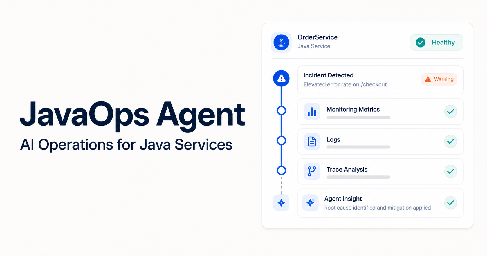
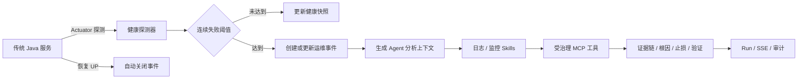
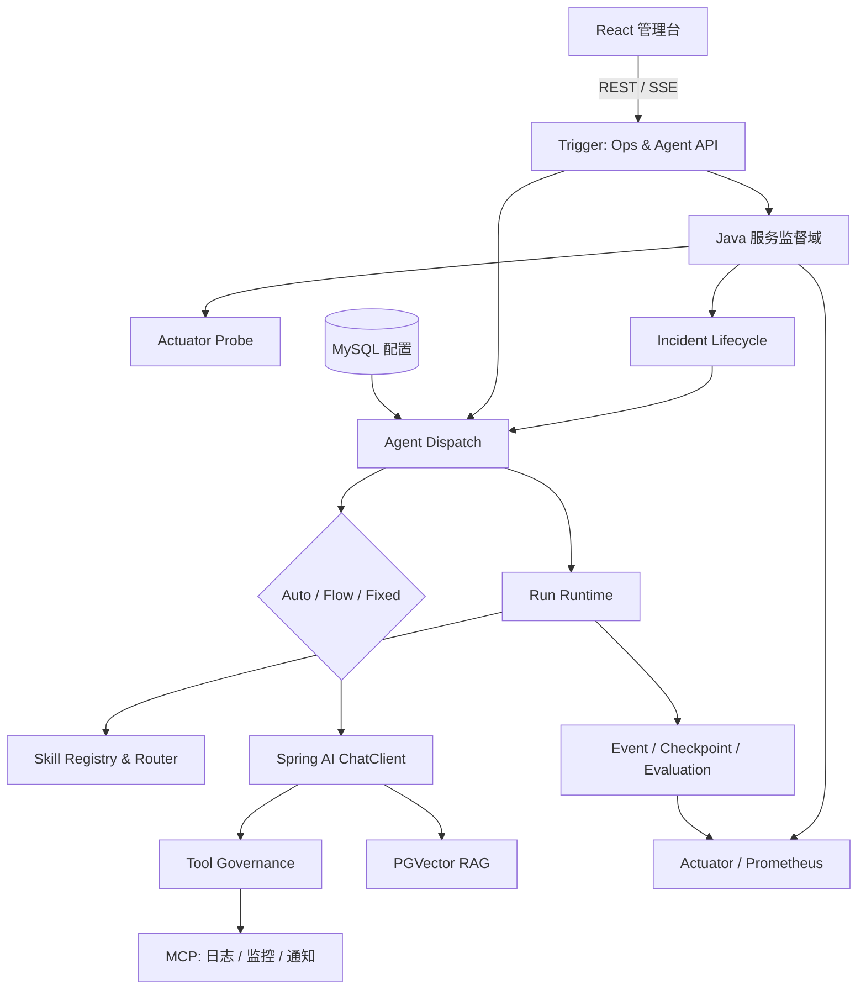

<h1 align="center">JavaOps Agent</h1>

<p align="center">
  面向传统 Java 服务的 AI Agent 智能运维分析平台<br/>
  主动发现异常，联动日志、监控与知识库完成可追踪的根因分析
</p>

<div align="center">


[在线介绍](https://wangyijie01.github.io/ai-agent-station-v2/) · [运维闭环](#-java-服务智能监督闭环) · [架构设计](#-架构设计) · [快速开始](#-快速开始) · [API](#-核心-api)

</div>

---

## 项目定位

通用大模型擅长自然语言理解与生成，但直接用于企业研发运维时仍有三个问题：它不了解具体服务上下文；不同场景依赖的 Prompt、知识库与工具差异很大；模型调用外部工具时缺少稳定的状态、权限与审计边界。

JavaOps Agent 不是一个通用聊天机器人，而是一套**可配置、可装配、可执行的 Java 服务智能运维平台**。系统主动探测 Spring Boot 服务，把连续异常聚合成运维事件，再按场景动态装配 Model、Prompt、Advisor、RAG、Skills 与 MCP 工具，输出包含证据链、可能根因、止损方案和验证步骤的分析结果。

典型场景：

- Java 服务健康监督与异常事件聚合
- 基于 TraceId、异常堆栈和时间窗口的日志根因分析
- Prometheus / Grafana 指标查询与异常趋势诊断
- 基于 PostgreSQL + PGVector 的内部知识问答
- 发布巡检、SQL 性能诊断和故障响应

> [!NOTE]
> 本仓库已整合 Spring Boot 后端、React 管理台和 GitHub Pages 项目介绍页。项目主线是“Java 服务智能运维”，Agent Runtime 与工具治理是保证该主线可靠执行的工程支撑。



## Java 服务智能监督闭环



系统已实现：

- 为每个服务配置健康端点、检查周期、超时、慢响应阈值和失败阈值
- 将单次抖动与持续故障分开处理，达到阈值后才创建事件
- 按服务去重活跃事件，累计出现次数并保留最近证据
- 支持事件确认、人工关闭、恢复自动关闭和关联 Agent Run
- 触发分析时固定选择 `monitoring-diagnosis` 与 `log-root-cause` Skills
- 输出 `ops_service_health`、探测耗时和事件计数等 Prometheus 指标
- 在 React「Java 服务监督」页面管理目标、查看快照与事件，并实时消费分析 SSE

详细规则与接口见 [Java 服务智能监督设计](docs/ops-supervision.md)。

## 核心能力

### 配置驱动的 Agent 动态装配

- Model、Prompt、Advisor、MCP、RAG 等组件以数据库配置组织
- 通过装配节点与 Spring 上下文按业务场景生成 ChatClient
- 新场景复用通用执行引擎，减少重复编写独立 Agent

### 多执行模式与文件型 Skills

- `Auto`：分析、执行、质量监督与总结循环
- `Flow`：工具分析、任务规划与步骤化执行
- `Fixed`：按配置节点执行确定性流程
- 6 个 `SKILL.md` 内置能力，声明场景、触发词、风险级别和最小工具白名单
- 支持显式选择与触发词路由，并返回命中原因

### MCP 与 RAG

- 通过 MCP 接入日志、监控、搜索、通知与内容发布等外部能力
- 兼容 SSE / Stdio 两种 MCP 连接方式
- 基于 PostgreSQL + PGVector 完成文档解析、向量存储、标签管理与检索增强
- 将工具返回结果作为证据，不允许其绕过应用侧治理

### 可恢复、可审计的 Agent Runtime

- 每次执行生成 `runId`、`traceId` 与严格递增事件序号
- 支持创建、运行、等待输入、成功、失败、取消等状态转换
- 通过幂等键抑制重复 Run，支持检查点、失败恢复和等待补充信息后继续执行
- 通过 SSE 推送决策、工具调用与状态变化，并提供事后查询和质量评估

### 工具调用治理

- 工具调用必须命中当前 Skills 合并后的白名单
- 按只读、中风险、高风险分级，高风险操作要求显式授权
- 支持调用预算、只读重试、幂等结果、熔断和敏感信息脱敏
- 记录决策、输入摘要、耗时、尝试次数和结果，便于追踪问题

## 架构设计



设计分为三层：

1. **业务目标层**：监督传统 Java 服务，发现异常并生成可处理的运维事件。
2. **Agent 能力层**：动态装配模型、Prompt、Advisor、RAG、Skills 与 MCP。
3. **工程保障层**：用 Run 状态机、工具治理、SSE、指标与审计约束非确定性行为。

更完整的状态机、执行时序和生产化取舍见 [Agent Runtime V2 设计](docs/agent-v2-design.md)，持久化表模型见 [Runtime SQL](docs/sql/agent-runtime-v2.sql)。

## 技术栈

| 分类 | 技术 | 用途 |
| --- | --- | --- |
| 后端 | Java 17、Spring Boot 3.4.3、Spring AI 1.0.0 | Web、Agent 编排、模型与工具集成 |
| 数据 | MySQL、MyBatis、Redis | 配置数据、持久化模型与分布式扩展 |
| 知识库 | PostgreSQL、PGVector、Tika | 文档解析、Embedding 与向量检索 |
| 工具协议 | MCP SSE / Stdio | 日志、监控、搜索、通知等外部工具 |
| 可观测 | Actuator、Micrometer、Prometheus | 健康检查、运行与探测指标 |
| 前端 | React 18、TypeScript、Semi UI、FlowGram | 管理台、监督页面和流程编辑器 |
| 工程 | Maven Wrapper、npm、Docker Compose、GitHub Actions | 构建、环境与持续集成 |

## 项目结构

```text
ai-agent-station-v2/
├── backend/
│   ├── ai-agent-station-study-api/            # 请求 DTO 与接口契约
│   ├── ai-agent-station-study-app/            # 启动、数据源与监督配置
│   ├── ai-agent-station-study-domain/         # Agent Runtime、Skills、运维监督域
│   ├── ai-agent-station-study-trigger/        # REST/SSE API 与定时探测
│   ├── ai-agent-station-study-infrastructure/ # MyBatis DAO、Repository、外部适配
│   └── ai-agent-station-study-types/          # 通用类型与框架组件
├── frontend/                                  # React 管理台与 Java 服务监督页面
├── docs/                                      # GitHub Pages、设计文档与 SQL
├── compose.yaml                               # MySQL / PGVector / Redis 本地环境
├── .env.example                               # 无敏感信息的配置模板
└── .github/workflows/                         # CI 与 Pages 自动发布
```

## 快速开始

### 1. 准备环境

要求：JDK 17+、Node.js 20+、Docker Desktop，以及一个 OpenAI 兼容模型服务。

```bash
git clone https://github.com/wangyijie01/ai-agent-station-v2.git
cd ai-agent-station-v2
cp .env.example .env
docker compose up -d
```

将 `.env` 中的密码与模型地址替换为本地配置。后端从 `backend` 目录启动时会可选读取仓库根目录的 `.env`；不要提交真实 API Key、数据库密码或令牌。

### 2. 启动后端

PowerShell：

```powershell
cd backend
./mvnw.cmd -pl ai-agent-station-study-app -am -DskipTests package
./mvnw.cmd -f ai-agent-station-study-app/pom.xml spring-boot:run
```

后端默认地址：`http://127.0.0.1:8099`

- 健康检查：`GET /actuator/health`
- Prometheus：`GET /actuator/prometheus`
- Agent API：`/api/v1/agent`
- 运维监督 API：`/api/v1/ops`

### 3. 启动前端

```bash
cd frontend
npm ci
npm run dev
```

开发环境默认请求 `http://127.0.0.1:8099`；生产构建可通过 `PUBLIC_API_BASE_URL` 指定后端，未配置时使用同源地址。

## 核心 API

### 运维监督 `/api/v1/ops`

| 方法 | 路径 | 说明 |
| --- | --- | --- |
| `GET / POST` | `/services` | 查询或保存 Java 服务监督目标 |
| `POST` | `/services/{serviceId}/probe` | 立即执行一次 Actuator 探测 |
| `GET` | `/snapshots` | 查询全部最新健康快照 |
| `GET` | `/incidents` | 查询运维事件，可按状态过滤 |
| `POST` | `/incidents/{id}/acknowledge` | 确认事件 |
| `POST` | `/incidents/{id}/resolve` | 人工关闭事件 |
| `POST` | `/incidents/{id}/analyze` | 创建关联 Agent Run，以 SSE 返回分析事件 |

### Agent Runtime `/api/v1/agent`

| 方法 | 路径 | 说明 |
| --- | --- | --- |
| `POST` | `/auto_agent` | 创建或恢复 Run，并通过 SSE 返回事件 |
| `GET / POST` | `/skills`、`/skills/route` | 查询 Skills 或预览路由 |
| `GET` | `/runs/{runId}` | 查询 Run 快照 |
| `GET` | `/runs/{runId}/events` | 查询有序事件 |
| `GET` | `/runs/{runId}/checkpoints` | 查询检查点 |
| `GET` | `/runs/{runId}/evaluation` | 查询确定性质量评估 |
| `GET` | `/runs/{runId}/tool-audits` | 查询工具调用治理记录 |
| `POST` | `/runs/{runId}/cancel` | 取消可中断的运行 |

## 验证

```powershell
# 领域测试：不依赖真实模型和外部中间件
cd backend
./mvnw.cmd -pl ai-agent-station-study-domain -am test

# 后端完整多模块打包
./mvnw.cmd -pl ai-agent-station-study-app -am -DskipTests package

# 前端静态检查与生产构建
cd ../frontend
npm run lint -- --quiet
npm run build
```

当前 19 项确定性测试覆盖 Skill 加载与路由、结构化决策解析、Run 状态转换与恢复、工具白名单与风险治理，以及 Actuator 状态判定、服务探测、失败阈值、事件去重、确认、关联 Run 和自动恢复闭环。GitHub Actions 会对每次 Push / Pull Request 重复执行这些门禁。

## 当前边界

- Agent Run、事件、检查点、工具审计，以及新增的监督快照与事件，当前使用有界进程内状态；适合演示完整领域语义，但应用重启后不会保留。
- [Runtime SQL](docs/sql/agent-runtime-v2.sql) 已给出 Run 与运维事件的 MySQL 表模型；多实例一致性仍需接入 Repository、Redis 幂等与租约。
- 工具能力取决于实际装配的 MCP 服务；Skill 声明的是最小权限边界，不代表对应工具一定在线。
- 管理 API 和探测目标在企业部署时必须置于受信网络，并由网关补充 RBAC、地址白名单和审批票据。
- `approvedToolNames` 仅演示运行级授权语义，生产环境不能信任普通客户端直接提交。

## Roadmap

- [x] Java 服务主动探测、失败抑制、事件去重与恢复闭环
- [x] 运维事件一键触发日志 / 监控 Agent 分析
- [x] 配置驱动 Agent 装配与 Auto / Flow / Fixed 执行模式
- [x] 文件型 Skills、Run 状态机、检查点和 SSE 审计
- [x] 工具白名单、风险分级、预算、重试、幂等与熔断
- [x] React Java 服务监督页与 Agent 运行台
- [x] Docker Compose 本地依赖与 GitHub Actions CI
- [ ] MySQL 持久化 Run、快照、事件与工具审计
- [ ] Redis 分布式幂等、多实例租约和任务恢复
- [ ] 企业 RBAC、服务发现、告警平台和审批系统接入
- [ ] 真实 MCP 沙箱端到端测试与离线评估数据集

## 来源与许可

本项目基于 KnowledgePlanet 的 [ai-agent-station-study](https://gitcode.net/KnowledgePlanet/ai-agent-station-study) 学习项目继续扩展，保留上游结构、署名和版权信息。Java 服务监督、文件型 Skills、Agent Runtime、工具治理、React 运维工作台、测试、设计文档与展示页由 [wangyijie01](https://github.com/wangyijie01) 在此基础上完成。

公开使用、二次开发或分发时，请同时遵守仓库内声明及上游项目的授权与版权要求。

---

<div align="center">

**JavaOps Agent · AI-powered Operations for Java Services**

[在线介绍](https://wangyijie01.github.io/ai-agent-station-v2/) · [查看源码](https://github.com/wangyijie01/ai-agent-station-v2) · [提交 Issue](https://github.com/wangyijie01/ai-agent-station-v2/issues)

</div>
