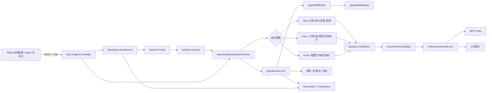
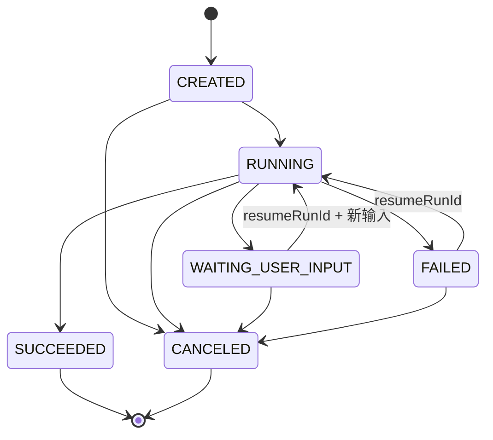
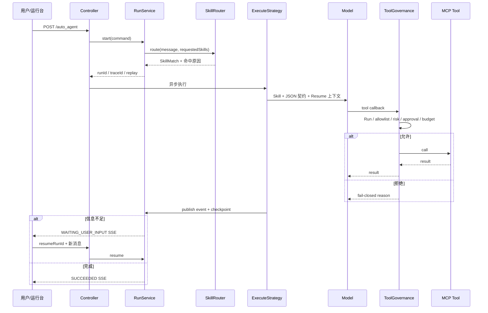

# JavaOps Agent：Java 服务智能运维与可治理 Agent Runtime

## 1. 项目目标

项目首先解决的是传统 Java 服务的研发运维问题：服务异常往往需要人工在监控、日志、Trace 和知识文档之间反复切换，不同业务又重复开发独立分析流程。因此系统主动探测 Spring Boot Actuator，把连续异常聚合成运维事件，再按场景装配日志、监控和知识库 Agent 完成证据检索与根因分析。

旧版本已经具备分析、执行、监督、总结的循环，也能通过 Spring AI 调用 MCP 工具，但仍有典型 Demo 局限：Prompt 和执行流程强耦合；模型输出靠自然语言标记解析；任务不能等待补充信息后恢复；工具只要被装配就可能被模型调用；缺少稳定的 run/trace、审计和评估接口。

所以系统目标分为三个层次：

1. 业务目标：形成“服务探测 → 事件聚合 → Agent 分析 → 恢复关闭”的 Java 智能运维闭环。
2. 能力平台：按场景动态装配 Model、Prompt、Advisor、RAG、Skills 与 MCP，复用 Auto、Flow、Fixed 执行引擎。
3. 工程保障：把非确定性的模型行为装进可恢复、可授权、可审计的运行边界。

具体工程目标：

1. 场景方法论由 Skill 管理，并与通用执行引擎解耦。
2. 每次执行成为有身份、有状态、有事件的 Run。
3. 工具调用必须在应用侧经过白名单、风险、预算和审批治理。
4. Agent 可以暂停、补充信息、恢复、取消，并能解释发生过什么。
5. 测试不依赖真实模型，关键确定性逻辑可单元验证。

## 2. 总体架构



核心设计是一条业务主链和两条控制面：

- 运维业务主链负责服务探测、失败抑制、事件去重、分析触发和恢复关闭，详细规则见 [Java 服务智能监督闭环](ops-supervision.md)。

- Run 控制面管理生命周期、幂等、事件和恢复。
- Tool 控制面管理模型能否以及如何调用外部能力。

模型负责生成候选决策，应用代码负责状态转换和副作用授权。

## 3. 运行生命周期



`AgentRunStatus` 集中定义合法转换。节点不能随意把成功 Run 改回运行，也不能恢复已取消的 Run。`AgentRunService` 为每次运行生成：

- `runId`：运行聚合主键。
- `traceId`：贯穿事件和审计的关联标识。
- `sequence`：Run 内严格递增的事件序号，解决 SSE 分块和前端排序问题。
- `idempotencyKey`：客户端网络重试时复用既有 Run，避免重复副作用。

当前事件和检查点保存在有界内存中，最多保留 1000 个 Run。该限制防止本地演示无限增长，但生产环境必须替换为持久化实现。

## 4. 执行时序



## 5. Skills：场景能力与执行引擎解耦

每个 Skill 是一个文件目录：

```text
agent-skills/
└── log-root-cause/
    └── SKILL.md
```

声明示例：

```yaml
---
id: log-root-cause
name: 日志根因分析
version: 1.0.0
description: 基于时间窗、TraceId、错误码和异常堆栈形成可追溯结论
scenes: [devops, log, elasticsearch, elk, incident]
trigger-words: [日志, 报错, 异常, traceid, error, elk, 根因]
allowed-tools: [search*, query*, list*, get*, fetch*, read*]
risk-level: READ_ONLY
priority: 100
---
```

路由规则按确定性顺序执行：

1. 用户显式指定的合法 Skill 优先。
2. 再根据消息中的触发词和场景词计分。
3. 分数相同时按 Skill 优先级排序。
4. 返回命中原因，便于前端解释和测试。
5. 无 Skill 命中时工具集合为空，工具治理保持 fail-closed。

这比让模型自由选择整套工具更安全，也比把所有场景 Prompt 写进 Java 节点更易扩展。当前采用文件型 Registry，适合版本随代码发布；生产上可以增加数据库绑定和灰度版本，但仍应保留文件校验与版本审计。

## 6. 结构化决策与兼容迁移

分析节点要求模型返回动作枚举和必要字段，例如：

```json
{
  "action": "CONTINUE",
  "reason": "已具备服务名和时间范围",
  "question": null,
  "nextAction": "查询错误率与超时日志"
}
```

支持的动作包括 `CONTINUE`、`WAIT_USER_INPUT` 和 `COMPLETE`；监督节点返回 `PASS`、`OPTIMIZE` 或 `FAIL`。`AgentDecisionParser` 优先解析 JSON，并保留旧中文标记作为迁移兜底。

工程取舍：JSON 不是绝对可靠，因此不能直接驱动任意反射或 SQL；解析后必须转成有限枚举，再由状态机验证。兼容解析器便于渐进迁移，但应通过指标观察 fallback 命中率，稳定后逐步收紧模型契约。

## 7. 工具治理

工具治理位于真实 `ToolCallback` 外层，不能只写在 Prompt 中。调用放行需要同时满足：

1. 存在可信 `runId`，并能查询到运行聚合。
2. 工具名命中当前 Skills 合并后的 `allowed-tools`。
3. Run 尚未超过 `maxToolCalls` 预算。
4. 高风险工具命中请求中的 `approvedToolNames`。
5. 熔断器没有打开。

风险分类：

| 级别 | 典型操作 | 策略 |
| --- | --- | --- |
| `READ_ONLY` | query/search/list/get/read/fetch/explain | 可在白名单内自动调用；瞬时失败最多重试一次 |
| `MEDIUM` | 未知或无法明确分类的操作 | 白名单内调用；按输入摘要做幂等缓存 |
| `HIGH` | write/update/create/delete/send/deploy/rollback/restart | 白名单 + 本轮显式人工授权；按输入摘要做幂等缓存 |

每次尝试记录工具名、风险、决策、输入 SHA-256、脱敏摘要、是否成功、是否幂等命中、重试次数、耗时和错误。API Key、token、password、secret 等常见字段在摘要中替换为 `***`。

这里的人工授权是“运行请求级能力票据”的本地实现，不等同于完整审批系统。生产化需要把审批人、角色、范围、有效期、一次性消费和撤销记录纳入服务端凭证，不能信任任意客户端自报授权。

## 8. 检查点、恢复和取消

检查点保存阶段、步骤、状态、执行摘要和下一动作。出现以下情况时 Run 可以被恢复：

- `WAITING_USER_INPUT`：用户补充环境、时间窗、TraceId 等必要信息。
- `FAILED`：瞬时依赖失败修复后重试。

恢复时，新消息会与检查点摘要共同写入 Prompt 上下文，Run 沿用原 `runId` 与 `traceId`，并生成新的事件。成功和取消状态是终态，不允许恢复。

取消通过 `Future.cancel(true)` 发出中断并把状态转为 `CANCELED`。这提供了协作式取消语义，但外部 MCP 是否能立即停止取决于其客户端是否响应线程中断/超时。生产环境还应为模型和工具分别设置 deadline，并用可取消的异步客户端传播取消信号。

## 9. 事件、指标与评估

统一 SSE 事件包含：

```text
eventId, runId, traceId, sequence, type, subType,
step, content, runStatus, timestamp, completed
```

运行时事件和原执行阶段事件进入同一条时间线，前端不再从自然语言猜测阶段。已实现的查询接口支持事后重放、问题定位和面试演示。

Prometheus 指标：

- `agent_run_transitions_total`：按目标状态统计转换次数。
- `agent_run_duration`：Run 完成耗时。
- `agent_tool_calls_total`：按工具和结果统计调用次数。
- `agent_tool_call_duration`：工具耗时。

`AgentEvaluation` 根据终态、步骤、工具失败、拒绝和事件完整性生成确定性分数及改进项。这是运行质量的启发式评估，不是假装拥有离线金标。生产评估应增加：任务级数据集、LLM-as-Judge 多裁判一致性、人工抽检、成功判据、成本/时延以及版本对照实验。

## 10. 数据模型与生产替换

`docs/sql/agent-runtime-v2.sql` 提供以下表：

- `ai_agent_skill`：Skill 元数据与版本。
- `ai_agent_skill_binding`：Agent 与 Skill 的绑定。
- `ai_agent_run`：运行聚合和状态。
- `ai_agent_run_event`：有序事件流。
- `ai_agent_checkpoint`：恢复检查点。
- `ai_agent_tool_audit`：工具治理审计。

当前实现与生产目标的边界：

| 维度 | 当前已实现 | 生产化替换 |
| --- | --- | --- |
| Run/事件 | 有界内存、并发容器、严格序号 | MySQL 分库表或事件存储，乐观锁 |
| 幂等 | 进程内索引 | Redis `SET NX` + 数据库唯一键 |
| 调度 | 进程内线程池和 Future | 队列/工作流引擎、租约、重试队列 |
| 授权 | 请求级工具名授权 | RBAC/审批系统签发的服务端票据 |
| 审计 | 进程内记录 + 查询 API | 不可篡改审计存储、留存策略 |
| Skill | classpath 文件 | 文件版本 + DB 绑定 + 灰度发布 |
| 评估 | 确定性启发式 | 数据集、人工标注、Judge、A/B |

## 11. 前端运行台

`frontend/src/pages/ops-supervision.tsx` 与 `frontend/src/pages/agent-runtime.tsx` 提供：

- 管理 Java 服务监督目标，查看健康快照、连续失败和聚合事件。
- 确认或关闭事件，并从事件上下文一键触发日志 / 监控 Agent 分析。
- 选择 Agent 和显式 Skills。
- 设置最大执行步数、工具预算、高风险工具授权。
- 新建 Run、按 runId 恢复、取消。
- 展示 runId、traceId、状态和有序 SSE 时间线。
- 查询评估结果和工具审计。

前端 SSE 解析按数据帧处理而不是简单对每个网络 chunk 做 `split('\n')`，避免 JSON 被 TCP 分块截断。运行台是治理能力的可视化入口，不绕过后端策略。

## 12. 测试与验收

不调用真实模型的领域单元测试覆盖：

- Skill 文件加载、显式优先与触发词路由。
- JSON 决策和旧格式 fallback。
- 状态转换、幂等重放、等待输入和恢复。
- 工具白名单、高风险授权、预算、幂等、只读重试和审计。
- Java 服务探测、连续失败阈值、事件去重、确认、Run 关联和自动恢复。

验收命令：

```powershell
cd backend
.\mvnw.cmd -pl ai-agent-station-study-domain -am test
.\mvnw.cmd -DskipTests compile

cd ..\frontend
npm run lint -- --quiet
npm run build
```

真实模型、数据库和 MCP 测试属于集成/端到端测试，需要独立环境和密钥，不应混进确定性单元测试。

## 13. 关键取舍

### 为什么不用一个巨型 Prompt？

巨型 Prompt 难以版本化、路由和最小权限授权。Skill 把场景流程、工具集合和风险声明放在同一版本单元中，通用执行器只负责生命周期。

### 为什么工具治理必须在 callback 层？

Prompt 只能影响模型意图，不能形成安全边界。模型可能忽略指令或被注入，副作用必须在代码调用点再次鉴权。

### 为什么保留旧格式解析？

为了低风险迁移已有 Agent 配置。V2 先优先 JSON 并观测 fallback，再逐步淘汰旧标记；一次性强切会让历史 Prompt 全部失效。

### 为什么先做内存 Runtime？

先验证聚合边界、API 和状态语义，再落数据库，可避免把错误模型固化进表。SQL 草案已经按最终语义设计，下一步替换 Repository 不改变上层执行协议。

### 如何防止重复执行高风险工具？

客户端幂等键防重复 Run，工具层再用 `runId + toolName + inputHash` 做幂等；生产还需数据库唯一约束、审批票据一次性消费，以及外部系统自己的幂等键。

## 14. 面试表达

### 30 秒版本

“我做的是一套面向传统 Java 服务的 Agent 智能运维平台。系统主动探测 Spring Boot Actuator，通过连续失败阈值抑制抖动并按服务聚合事件，再自动组合日志分析和监控诊断 Skills，通过 MCP 查询指标、日志与 Trace，输出证据链、根因和止损方案。底层用配置驱动方式装配 Model、Advisor、RAG 和工具，并通过 runId、状态机、检查点、工具白名单、风险审批、SSE 和 Prometheus 保证分析过程可恢复、可追踪、可审计。”

### 3 分钟展开顺序

1. 先讲业务问题：Java 服务异常依赖人工跨监控、日志、Trace 和知识库排查。
2. 用一次故障说明探测、失败抑制、事件聚合、Skills 路由与证据查询闭环。
3. 再讲配置驱动装配如何复用 Model、Advisor、RAG、MCP 与三类执行模式。
4. 说明 Run 生命周期和 Tool 治理如何控制非确定性与副作用。
5. 给出测试、SSE、traceId 和 Prometheus 指标证据。
6. 最后主动说明内存版边界及 MySQL/Redis/队列生产化方案。

### 高频追问

**Q：模型输出不合法怎么办？** 先解析 JSON 契约，失败后兼容旧标记；仍无法确定时返回保守动作，不直接触发副作用。状态机和工具策略是第二道确定性校验。

**Q：服务重启还能恢复吗？** 当前不能，这是明确边界。生产化按 SQL 模型持久化 Run、事件和检查点，Redis 管理幂等与租约，Worker 从队列继续执行。

**Q：用户能否伪造 `approvedToolNames`？** 本地版可以由受信运行台传入，只用于演示治理链路；生产必须由服务端审批系统签发、校验和消费授权票据。

**Q：Skill 与 MCP 的关系？** Skill 是场景流程和允许能力的策略单元；MCP 是工具协议和连接方式。Skill 可以允许一组 MCP 工具，但不会自动提供工具，也不能绕过治理。

**Q：如何评价 Agent 真的变好了？** 单元测试验证确定性语义；线上用成功率、等待率、工具拒绝/失败率、时延和成本；离线用版本化任务集、人工金标与多裁判评估做回归和 A/B。

## 15. 后续路线

1. 将 Run、Event、Checkpoint、Audit 抽象为 Repository 并接入 MySQL/Redis。
2. 用消息队列或工作流引擎实现 Worker 租约、超时和崩溃恢复。
3. 接入企业审批/RBAC，为高风险调用签发一次性授权票据。
4. 建立离线评估集、Prompt/Skill 版本基线和 CI 回归门禁。
5. 对上下文做 token 预算、摘要压缩、证据去重和缓存。
6. 增加前端自动化测试与真实 MCP 沙箱端到端测试。
