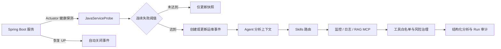

# Java 服务智能监督闭环

## 目标

平台面向传统 Java 服务的研发运维场景，不把 Agent 当作通用聊天机器人。系统主动发现服务异常，把健康探测、监控指标、日志与知识库证据组织成可追踪事件，再由 Agent 通过受治理工具完成分析。



## 核心规则

1. 每个监督目标独立配置检查周期、超时、慢响应阈值和连续失败阈值。
2. 单次抖动只更新快照，不立即制造告警；达到阈值后按 `serviceId` 聚合事件。
3. 活跃事件再次异常只增加出现次数和证据，不重复创建事件。
4. 服务恢复为 `UP` 时自动关闭对应事件，形成检测与恢复闭环。
5. Agent 分析默认绑定 `monitoring-diagnosis` 与 `log-root-cause` Skills。
6. Actuator 响应被视为不可信数据，只作为证据，不会被当作指令执行。
7. MCP 调用仍需通过工具白名单、风险分级、预算、审批与审计。

## 健康状态判定

| 状态 | 典型条件 | 事件级别 |
| --- | --- | --- |
| `UP` | HTTP 成功、Actuator 为 UP、延迟未超过阈值 | 不创建事件，并恢复活跃事件 |
| `DEGRADED` | 4xx、非 UP 状态或慢响应 | `WARNING` |
| `DOWN` | 5xx、连接失败、超时或 Actuator 为 DOWN | `CRITICAL` |

## API

基础路径：`/api/v1/ops`

| 方法 | 路径 | 说明 |
| --- | --- | --- |
| `GET` | `/services` | 查询监督目标 |
| `POST` | `/services` | 新增或更新目标 |
| `DELETE` | `/services/{serviceId}` | 删除无活跃事件的目标 |
| `POST` | `/services/{serviceId}/probe` | 立即探测单个服务 |
| `POST` | `/services/probe-all` | 立即探测全部服务 |
| `GET` | `/snapshots` | 查询最新健康快照 |
| `GET` | `/incidents` | 查询事件，可按状态过滤 |
| `POST` | `/incidents/{incidentId}/acknowledge` | 确认事件 |
| `POST` | `/incidents/{incidentId}/resolve` | 人工关闭事件 |
| `POST` | `/incidents/{incidentId}/analyze` | 触发 Agent 分析并返回 SSE |

目标示例：

```json
{
  "serviceName": "order-service",
  "environment": "prod",
  "baseUrl": "http://order-service:8080",
  "healthPath": "/actuator/health",
  "agentId": "3",
  "intervalSeconds": 30,
  "timeoutMs": 3000,
  "failureThreshold": 3,
  "slowThresholdMs": 1500,
  "enabled": true
}
```

## 可观测指标

- `ops_service_health`：`1=UP`、`0=DEGRADED`、`-1=DOWN`。
- `ops_service_probe_duration`：服务探测耗时。
- `ops_incidents_total`：按服务和级别统计创建的事件数。

## 当前边界

监督目标、健康快照和事件当前采用有界进程内状态，便于无额外表迁移地演示完整领域闭环；多实例与重启恢复需要按 `docs/sql/agent-runtime-v2.sql` 中的表模型接入 MySQL/Redis。探测接口应部署在受信网络内，并由网关限制目标地址与管理 API 权限。
